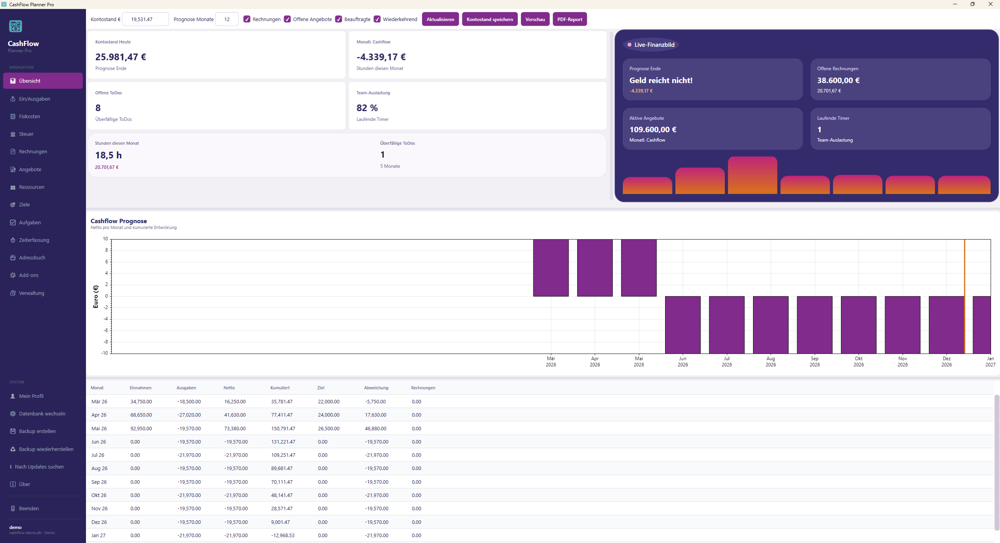
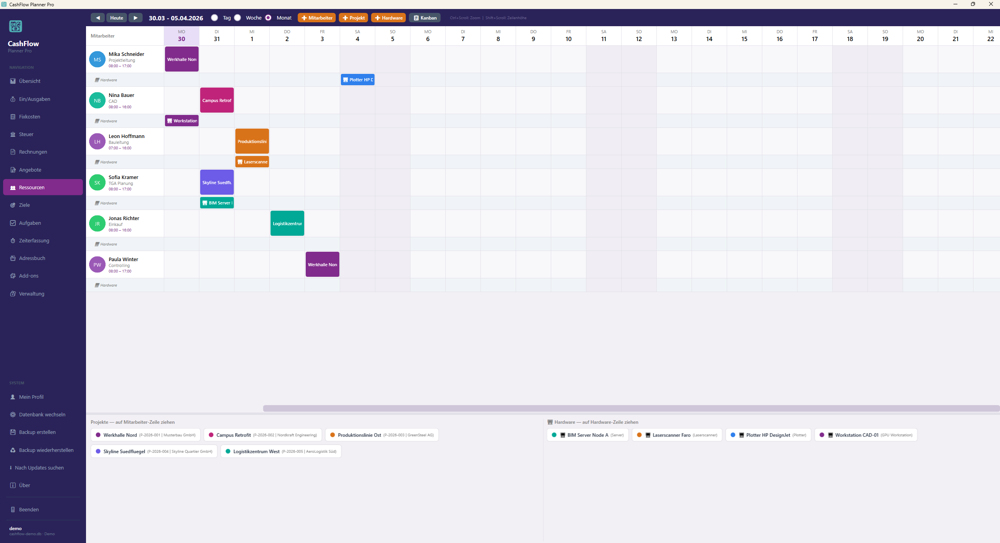
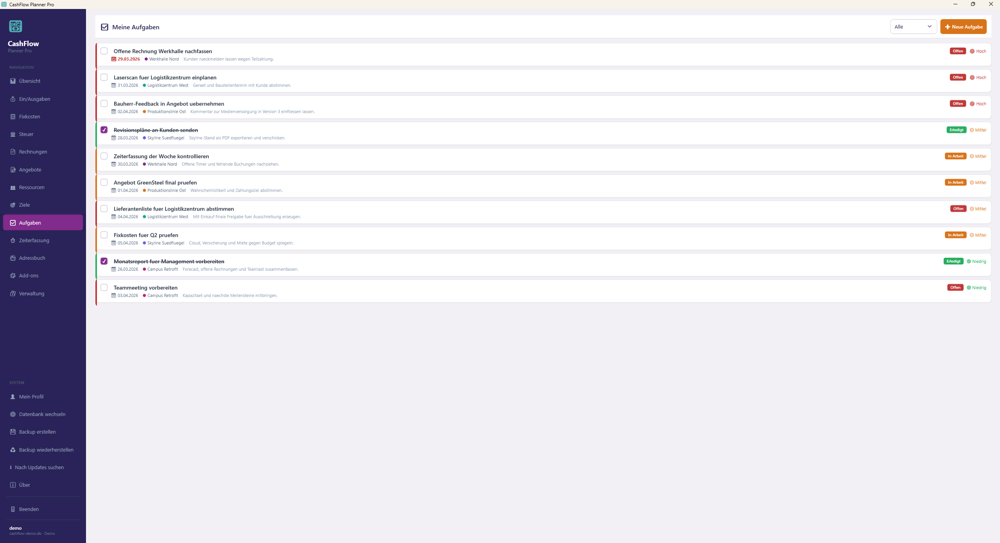
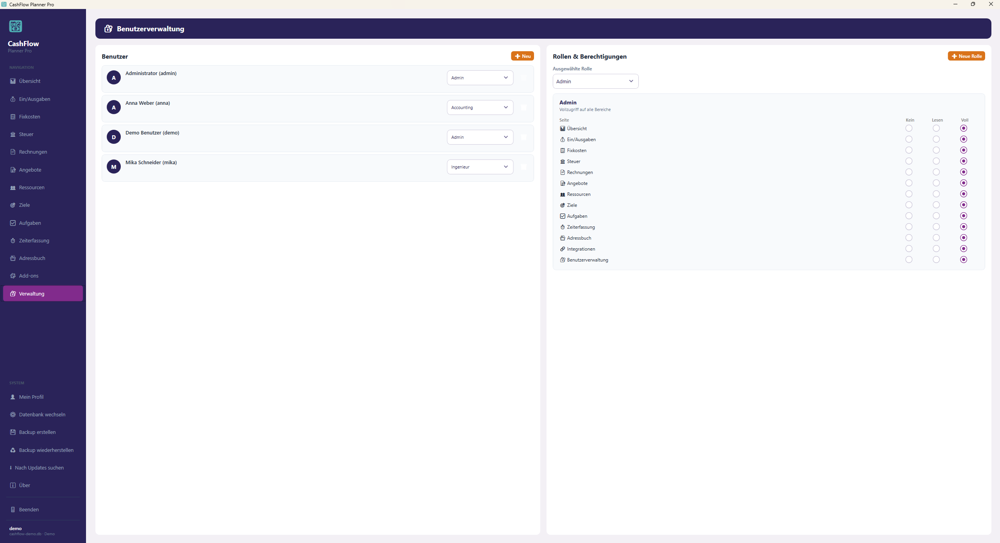

# CashFlow Planner Pro

## Deutsch

CashFlow Planner Pro ist eine moderne Windows-Desktop-App fuer Cashflow-Prognosen, Rechnungen, Angebote, Projekte, Ressourcenplanung, Zeiterfassung und operative Unternehmenssteuerung.

### Highlights

- Cashflow-Dashboard mit Forecast, KPI-Karten, PDF-Report und Vorschau
- Verwaltung von Rechnungen, Angeboten, Fixkosten, Steuern und Zielen
- Projekt- und Ressourcenplanung inklusive Hardware- und Mitarbeiterbelegung
- Aufgabenmanagement, Rollen & Berechtigungen sowie Demo-Modus
- Backup & Restore, Add-ons und sevDesk-Import mit Vorschau

### Screenshots

<table>
  <tr>
    <td></td>
    <td></td>
  </tr>
  <tr>
    <td><strong>Dashboard & Cashflow-Prognose</strong></td>
    <td><strong>Ressourcen- und Einsatzplanung</strong></td>
  </tr>
  <tr>
    <td></td>
    <td></td>
  </tr>
  <tr>
    <td><strong>Aufgaben, Prioritaeten und Status</strong></td>
    <td><strong>Benutzerverwaltung, Rollen und Rechte</strong></td>
  </tr>
</table>

### Technik

- .NET 10
- WPF Desktop App
- SQLite und MariaDB
- ScottPlot, PDF-Export und Integrations-Add-ons

### Start

```powershell
dotnet build CashFlowPlannerPro.sln
```

Oder die Solution [CashFlowPlannerPro.sln](CashFlowPlannerPro.sln) in Visual Studio oeffnen.

### Lizenz

Dieses Projekt steht unter der GPL-3.0-or-later. Details in [LICENSE](LICENSE).

---

## English

CashFlow Planner Pro is a modern Windows desktop application for cash flow forecasting, invoicing, offers, project control, resource planning, time tracking, and operational business management.

### Highlights

- Cash flow dashboard with forecast, KPI cards, PDF reporting, and preview
- Management of invoices, offers, fixed costs, taxes, and financial targets
- Project and resource planning including hardware and team allocation
- Task management, roles & permissions, and a built-in demo mode
- Backup & restore, add-ons, and sevDesk import with preview

### Screenshots

<table>
  <tr>
    <td></td>
    <td></td>
  </tr>
  <tr>
    <td><strong>Dashboard & cash flow forecast</strong></td>
    <td><strong>Resource and deployment planning</strong></td>
  </tr>
  <tr>
    <td></td>
    <td></td>
  </tr>
  <tr>
    <td><strong>Tasks, priorities, and statuses</strong></td>
    <td><strong>User management, roles, and permissions</strong></td>
  </tr>
</table>

### Technology

- .NET 10
- WPF desktop application
- SQLite and MariaDB
- ScottPlot, PDF reporting, and integration add-ons

### Getting Started

```powershell
dotnet build CashFlowPlannerPro.sln
```

Or open [CashFlowPlannerPro.sln](CashFlowPlannerPro.sln) in Visual Studio.

### License

This project is licensed under GPL-3.0-or-later. See [LICENSE](LICENSE) for details.
